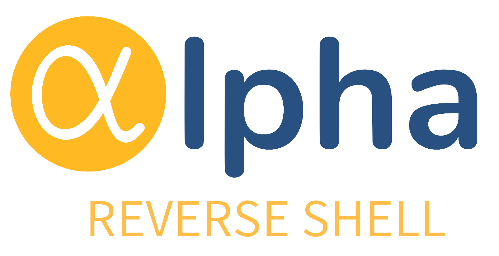

  

    
    
    

## 📜 Description

**Alpha** is a **Reverse Shell** application developed as a learning tool in the fields of cybersecurity and Python programming. Alpha aims to provide practical insights into managing reverse shell connections and monitoring sessions in real-time. This application is designed for use in a testing and learning environment with a focus on network security and software development.

### Key Features:

- **Connection Management**: Accepts and manages multiple reverse shell connections from various clients. Provides features to view connection status in real-time, including IP address, server name, and online/offline status.
- **Session Interaction**: Allows users to connect to active sessions and interact with the client’s shell, execute commands, and view output directly.
- **Connection Monitoring**: Periodically monitors connection status to detect disconnected sessions and update connection status.
- **Session Management**: Provides functions to connect to sessions, terminate active sessions, and update the status of offline sessions.
- **Security and Alerts**: Checks sent commands to detect potentially dangerous or risky commands, issuing warnings to users if the commands could jeopardize the shell session.
- **User Interface**: Utilizes `prompt_toolkit` for an interactive command-line interface with text styling and dynamic prompts.

### Learning Objectives:

- **Understanding Reverse Shells**: Gain insights into the concept and implementation of reverse shells and how they operate within the context of network security. Learn about how reverse shells can be used to gain remote access to systems and techniques for managing such connections.
- **Connection Management**: Learn techniques for efficiently managing and monitoring network connections, including detecting and handling connection issues.
- **Python Programming**: Sharpen skills in Python programming, particularly in the context of networking and user interfaces. Learn about using Python libraries such as `socket`, `threading`, and `prompt_toolkit` to build effective and responsive applications.
- **Application Development**: Understand techniques and practices in developing CLI (Command Line Interface) applications, and how to design and implement application features efficiently.

**Note**: Alpha is designed for educational and testing purposes. Use of this application should be conducted in a safe and legal environment and adhere to applicable cybersecurity laws and ethics.

## 📚 Reference Tools

- **Villain** by [t3l3machus](https://github.com/t3l3machus/Villain) - A powerful multi-client/multi-session reverse shell manager for advanced penetration testing.